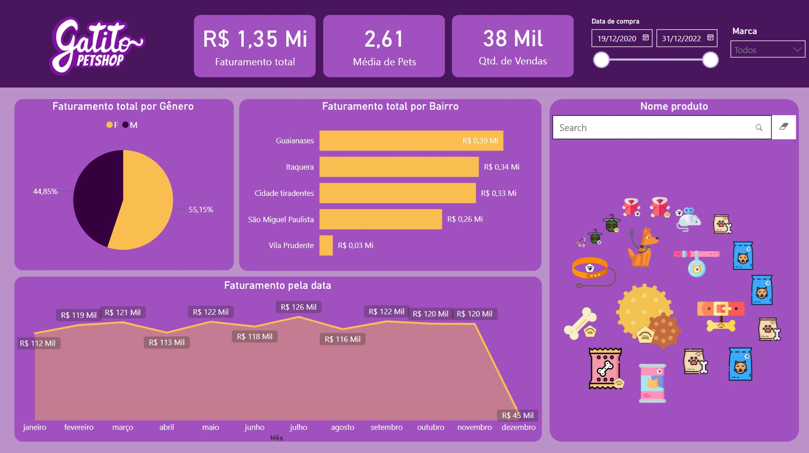

# 🐾 Gatito Petshop - Dashboard em Power BI

Este projeto foi desenvolvido como parte do curso de Power BI da **Alura**, no qual foi proposto a construção de um relatório interativo para uma empresa fictícia do segmento pet: **Gatito Petshop**.

O objetivo foi aplicar os conhecimentos de Power BI na prática, utilizando um cenário realista para analisar **faturamento, comportamento de compra e desempenho por região**.

## 🧠 Objetivos do Projeto

- Visualizar o total de faturamento por gênero e por bairro
- Analisar o desempenho mensal das vendas
- Identificar produtos com maior saída
- Avaliar a média de pets por venda
- Aplicar filtros por data e marca

## 📊 Visão Geral do Dashboard

- Faturamento total, quantidade de vendas e média de pets por venda
- Faturamento por gênero dos tutores
- Faturamento por bairro (top 5)
- Evolução do faturamento ao longo dos meses
- Busca por nome de produto
- Filtro de data e marca

## 🛠️ Tecnologias Utilizadas

- **Power BI Desktop**
- Power Query para transformação dos dados
- DAX para criação de medidas
- Visualizações nativas e personalizadas

## 🎓 Base de Estudo

Este projeto foi desenvolvido com apoio do conteúdo apresentado no curso da **Alura**:
> **Curso: "Power BI Desktop: construindo meu primeiro dashboard"**  
> Plataforma: [Alura](https://www.alura.com.br/)  

A estrutura do relatório e as análises foram guiadas durante o curso, com adaptações visuais e toques pessoais.

## 📁 Estrutura do Projeto
📂 gatito-petshop-powerbi
├── gatito-dashboard.pbix
├── imagens/
│ └── gatitopetshop-dashboard.png
└── README.md

---

**Desenvolvido por:** Fabio Cerqueira Jeronymo  
💼 Estudante de Ciência da Computação | Power BI | SQL | Python | Dados

